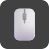
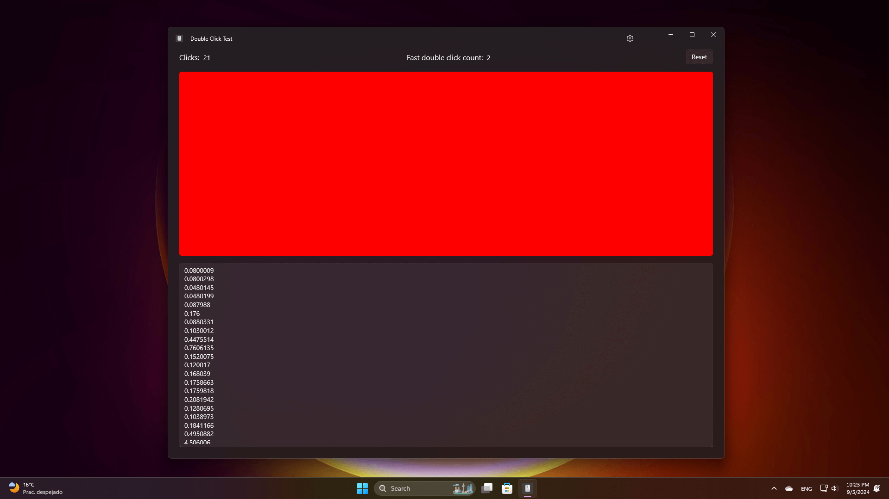

    

# Double Click Test
Welcome to the official repo for **Double Click Test**.

 

### Description
Light and simple application that helps you detect if your mouse buttons are performing unintentional double clicks. Ideal to check the status of your mouse and avoid clicking accuracy problems.

 

---

## Autor

	
	 
	<a href="https://github.com/alexfalconflores">Alex Stefano Falcon Flores</a>

